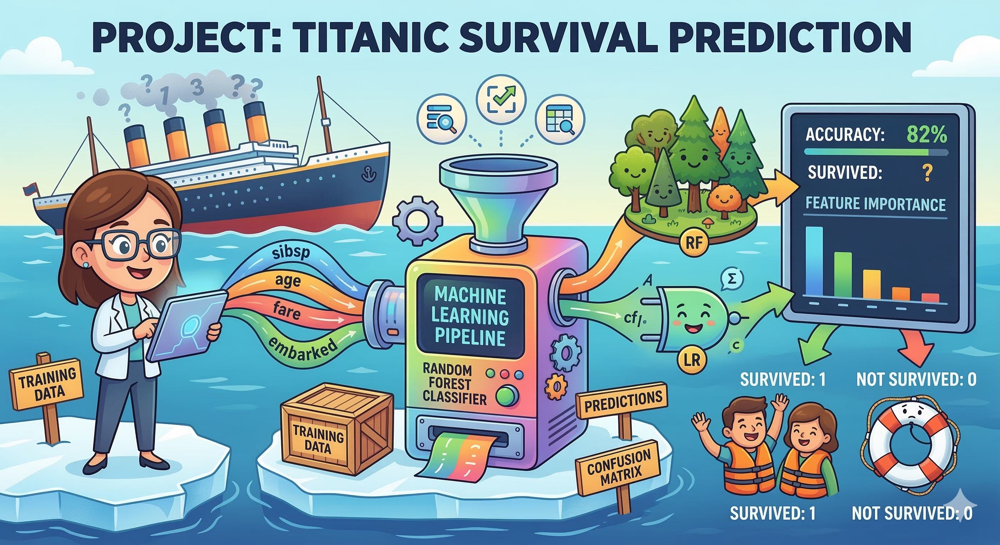
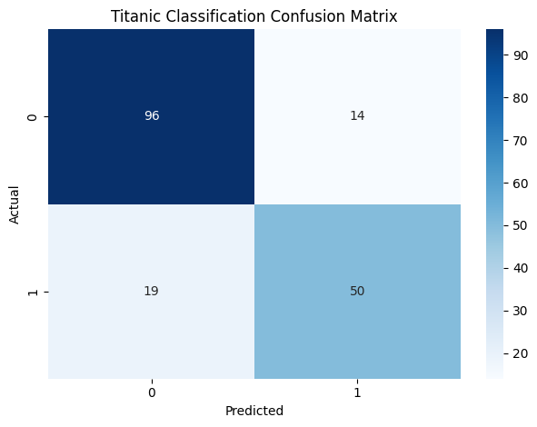
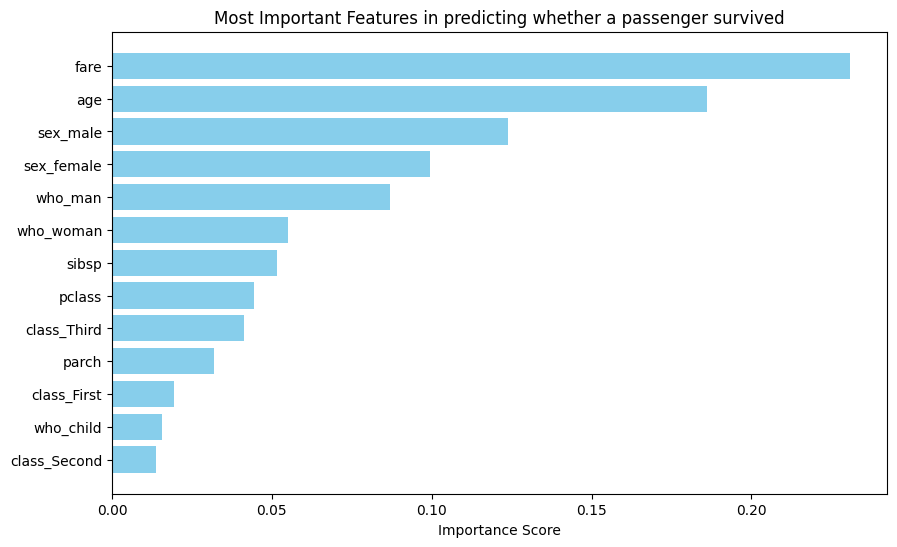
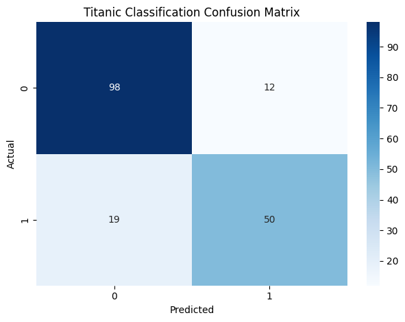
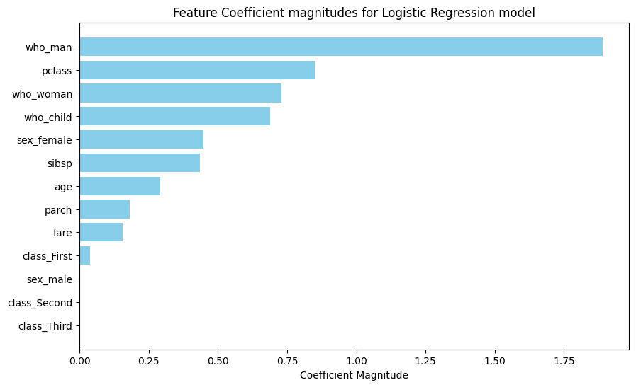

# Titanic Survival Prediction

This project predicts whether a passenger survived the Titanic disaster using two classification models:

- Random Forest
- Logistic Regression

The notebook builds a preprocessing pipeline, tunes model hyperparameters with cross-validation, evaluates both models on a held-out test set, and compares their learned feature effects.

## Dataset

The dataset is the Titanic dataset loaded from Seaborn.

Here is the data dictionary:

| Variable | Definition |
|:------|:--------------------------------|
| survived | survived? 0 = No, 1 = yes |
| pclass | Ticket class (int) |
| sex | sex |
| age | age in years |
| sibsp | # of siblings / spouses aboard the Titanic |
| parch | # of parents / children aboard the Titanic |
| fare | Passenger fare |
| embarked | Port of Embarkation |
| class | Ticket class (obj) |
| who | man, woman, or child |
| adult_male | True/False |
| alive | yes/no |
| alone | yes/no |

I drop "embarked", "embark-town", "age", and "deck"

## Features and Target

The target variable is:

- `survived`

The selected features are:

- `pclass`
- `sex`
- `age`
- `sibsp`
- `parch`
- `fare`
- `class`
- `who`
- `adult_male`
- `alone`

The data is split into training and test sets using stratification so the class proportions remain similar in both sets.

## Preprocessing

The notebook separates features into:

- numerical features
- categorical features

imputer:
- if a value is missing, it replaces it with the median of that column
- if a value is missing, it replaces it with the most common value in that column

The preprocessing pipeline is:

- numerical features -> median imputation -> standard scaling
- categorical features -> most frequent imputation -> one-hot encoding

One-hot encoding converts each categorical value into a binary indicator column. For example, a feature like `sex` may become columns such as `sex_male` and `sex_female`.

## Models Used

### 1. Random Forest

Random Forest is an ensemble of decision trees. Each tree learns different decision rules, and the final prediction is based on the combined output of all trees. It is useful because it can capture nonlinear patterns and interactions between features.

The notebook tunes Random Forest using grid search over:

- number of trees
- tree depth
- minimum samples required to split

### 2. Logistic Regression

Logistic Regression is a linear classification model that predicts the probability of class membership. It is easier to interpret than Random Forest because each processed feature gets a coefficient.

For binary classification, the model uses the logistic function:

`p(y=1|x) = 1 / (1 + e^(-(w^T x + b)))`

where:

- `x` is the input feature vector
- `w` is the coefficient vector
- `b` is the bias term

A positive coefficient increases the tendency toward survival, while a negative coefficient decreases it. In the notebook, feature effects are compared by coefficient magnitude.

## Cross-Validation and Model Selection

StratifiedKFold splits data into train/test sets with same proportion as original data type counts.

Grid search is used together with 5-fold stratified cross-validation. This means:

- the training data is split into 5 folds
- each fold keeps approximately the same survival/non-survival proportion as the full training set
- multiple hyperparameter combinations are tested
- the model with the best cross-validation accuracy is selected

## Technical Workflow

The notebook follows this order:

1. Load Titanic data from Seaborn
2. Select features and target
3. Split data into train and test sets
4. Detect numerical and categorical columns
5. Build preprocessing pipelines
6. Combine preprocessing using `ColumnTransformer`
7. Build a full pipeline with classifier
8. Tune Random Forest with `GridSearchCV`
9. Evaluate Random Forest using classification report and confusion matrix
10. Extract one-hot encoded feature names
11. Display Random Forest feature importances
12. Replace classifier with Logistic Regression
13. Tune Logistic Regression with `GridSearchCV`
14. Evaluate Logistic Regression using classification report and confusion matrix
15. Extract Logistic Regression coefficients
16. Plot coefficient magnitudes

## Feature Importance and Coefficients

### Feature Importance

Below, I take best estimator from GridSearchCV. Feature_importances_values say how much each feature was used by the model.
This ususally works on tree-based models:
- Decision Tree
- Random Forest
- XGBoost / Gradient Boosting  

It does not work with models that have coef_.

For Random Forest, the notebook reads `feature_importances_` from the best trained classifier. Since categorical variables are one-hot encoded, the final feature list is built by combining:

- original numerical feature names
- one-hot encoded categorical feature names

### Display feature importances in bar

The feature importance bar chart shows which processed features contributed most strongly to the Random Forest model.

There might be some dependency among features.

### Another model: Logistic Regression

Getting logistic regression feature coefficients

For Logistic Regression, the notebook uses `coef_` instead of `feature_importances_`. The plotted values are coefficient magnitudes, which show how strongly each processed feature affects the decision boundary.

## Results and Figures

### Random Forest

Confusion matrix:

Feature importance plot:

### Logistic Regression

Confusion matrix:

Feature coefficient magnitude plot:

## Analysis

Both models perform similarly on this dataset, but they explain feature influence differently.

- Random Forest measures importance based on how much a feature helps split the data across trees.
- Logistic Regression measures importance through learned coefficients on the processed features.

Because categorical features are expanded through one-hot encoding, one original variable can appear as several processed columns. This can make interpretation more detailed, but also more fragmented.

Both model have similar performances but their feature importances are different. This means more exploration is needed to do to understand important features.
Also, there might be some correlation matrices required to know the relationship between features, for example, between the variables who_man, who_woman, and who_child, we might have correlation because if a person is neither a man nor a woman, then they must be a child.

## Files

- `titanic-survival-prediction.ipynb` — main notebook
- `header.png` — project header image
- `confusion-matrix-randomforest.png` — Random Forest confusion matrix
- `confusion-matrix-logisticregression.png` — Logistic Regression confusion matrix
- `feature-bar-randomforest.png` — Random Forest feature importance plot
- `feature-bar-logisticregression.png` — Logistic Regression coefficient magnitude plot
